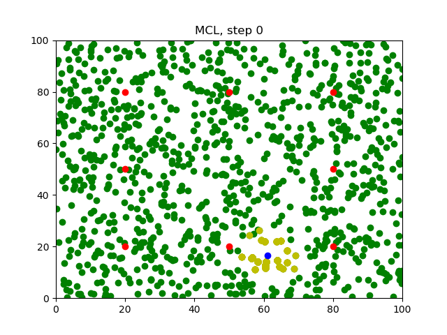
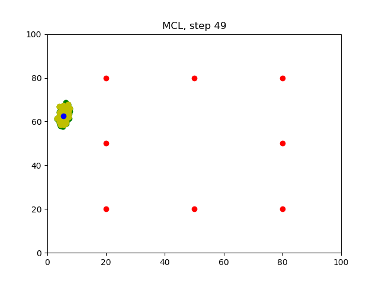

# Particle Filter
You will be able to observe the `MCL` in action through the generated images. 

### Compiling the Program
```sh
$ cd Desktop/
$ git clone https://github.com/basavarajnavalgund/particle_filter
$ cd particle_filter/
$ rm -rf images/*
$ mkdir build/
$ cd src/
$ g++ main.cpp -o ../build/app -std=c++11 -I/usr/include/python2.7 -lpython2.7
```

### Running the Program
Before you run the program, make sure the `Images` folder is empty!
```sh
$ ../build/app
```
Wait for the program to iterate `50` times.

### Generated Images
After running the program, `50` images will be generated in the `Images` folder.
#### Step0

#### Step49


